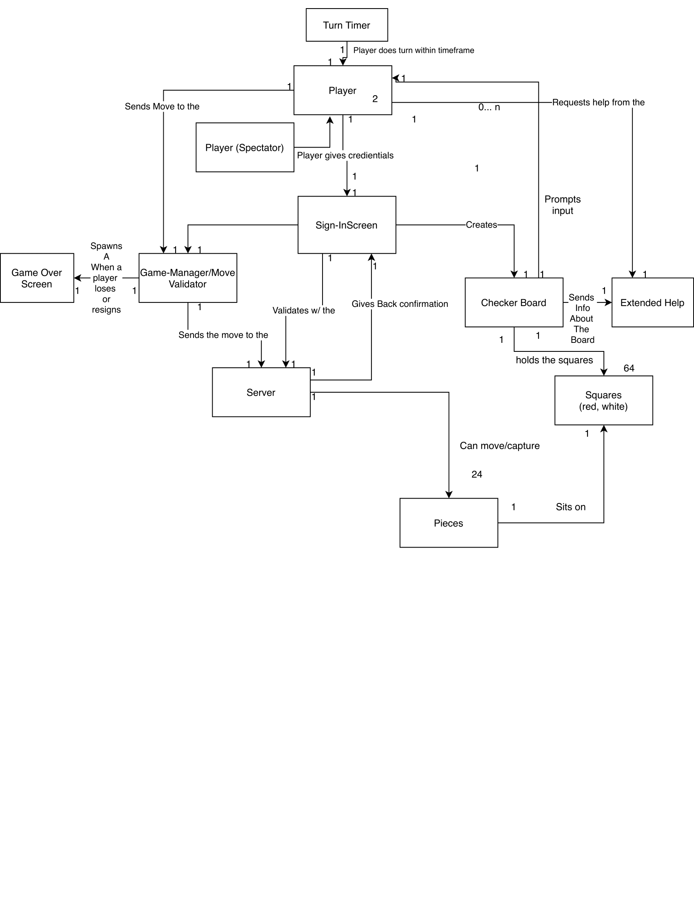
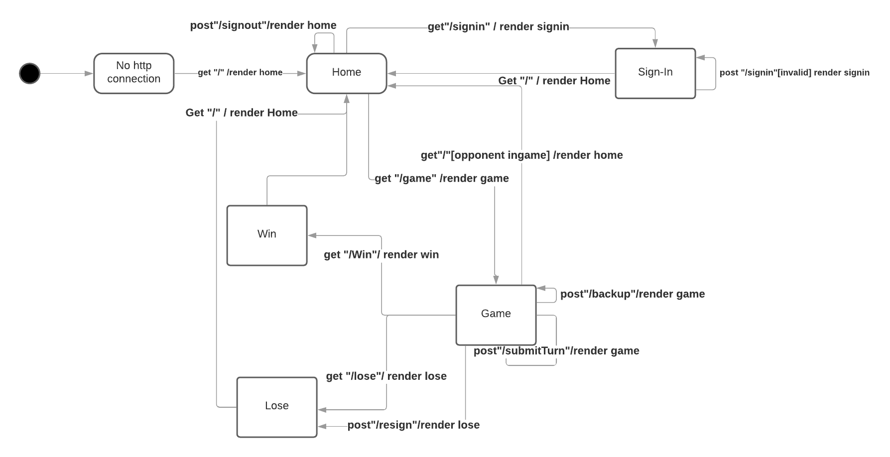

# PROJECT Design Documentation

## Team Information
* Team name: Team A
* Team members
  * Aubrey Tarmu
  * Ethan Yi
  * Tony Jiang

## Executive Summary
> Web-Checkers is a web based checkers game that can be played by two separate users through a server. The user interface of the checkers game supports browser drag and drop functionality. This application is a Java based web server and utilizes the Spark web micro framework and the FreeMarker template engine. Beyond implementing a a basic checkers game, we have plans to create some more additional features to enhance user experience.

### Purpose
> The purpose is to make a game of checkers that can be easily played over the internet. The user group is people who have internet excess and an interest in checkers, the goal is for them to be able to play checkers.

### Glossary and Acronyms

| Term | Definition |
|------|------------|
| VO | Value Object |
| VM | View Model |
| CUT| Component under test  |

## Requirements

This section describes the features of the application.

### Definition of MVP
> The minimum viable product is a product that should be able to allow players to sign in and sign out. 
And once they are signed in, they should be able to challenge and play and American game of checkers with an opponent.
Players may resign, or forfeit, if they wish to.

### MVP Features
> The highest level features of this product include Signing in, starting a game, and updating board through turns.
Sign in functionality helps the user create his/her unique identifier so that someone else can challenge them once they are online.
Starting a game overviews the process of challenging a user and creating a game for both players, unless they are already ingame.
Updating board covers how the gameboard updates after submitting each turn.

### Roadmap of Enhancements
> Possible enhancements include:
Creating a spectator mode, where others can spectate other ongoing games.
Creating a replay mode, where players can replay previous matches.
Creating a turn timer, where players must finish their turn in an alloted time.

## Application Domain

This section describes the application domain.

> The domain model shows the relationship between the application domain and player behavior.
From sign in, the webcheckers mainly revolves around the relationship between the player, server, and the checkerboard.
As seen from the circular relationship from these 3 entities, player behavior with the gameboard can be easily visualized, until 
the game ends.

## Architecture and Design

This section describes the application architecture.

### Summary

The following Tiers/Layers model shows a high-level view of the webapp's architecture.

As a web application, the user interacts with the system using a
browser.  The client-side of the UI is composed of HTML pages with
some minimal CSS for styling the page.  There is also some JavaScript
that has been provided to the team by the architect.

The server-side tiers include the UI Tier that is composed of UI Controllers and Views.
Controllers are built using the Spark framework and View are built using the FreeMarker framework.  The Application and Model tiers are built using plain-old Java objects (POJOs).

Details of the components within these tiers are supplied below.

### Overview of User Interface

This section describes the web interface flow; this is how the user views and interacts
with the WebCheckers application.

> This statechart shows all possible states that the user web interface can be in. From no connection to signin, to playing games,
the HTTP verbs between states show how each view interacts with eachother. The flow of states clearly indicate predictive and deterministic
manners of players, accounting for potential errors when navigating the pages.

### UI Tier
> _Provide a summary of the Server-side UI tier of your architecture.
> Describe the types of components in the tier and describe their
> responsibilities.  This should be a narrative description, i.e. it has
> a flow or "story line" that the reader can follow._

> _At appropriate places as part of this narrative provide one or more
> static models (UML class structure or object diagrams) with some
> details such as critical attributes and methods._

> _You must also provide any dynamic models, such as statechart and
> sequence diagrams, as is relevant to a particular aspect of the design
> that you are describing.  For example, in WebCheckers you might create
> a sequence diagram of the `POST /validateMove` HTTP request processing
> or you might show a statechart diagram if the Game component uses a
> state machine to manage the game._

> _If a dynamic model, such as a statechart describes a feature that is
> not mostly in this tier and cuts across multiple tiers, you can
> consider placing the narrative description of that feature in a
> separate section for describing significant features. Place this after
> you describe the design of the three tiers._

> The UI tier is majorly comprised of routes and their functionality dependent on the route handlers. 
The majority of the time spent in the application will be on the Gethomeroute which handles situations where the home page is triggered.
From homepage, getsigninroute will render a sign in page with a text prompt which is sent to postsigninroute to see if user successfully logged
in or needs to input a different user depending on error. If successful, the home page is rendered again, this time with a user identity.
From here, challenging an opponent will trigger getgameroute, with a queryparams stating who the opponent is. If the opponent is challenged, they
will be redirected to getgameroute as well. 
This is what has been properly implemented so far, the rest will be finished in the next sprint.

### Application Tier
> _Provide a summary of the Application tier of your architecture. This
> section will follow the same instructions that are given for the UI
> Tier above._
> 

### Model Tier
> _Provide a summary of the Application tier of your architecture. This
> section will follow the same instructions that are given for the UI
> Tier above._

### Design Improvement
> _Discuss design improvements that you would make if the project were
> to continue. These improvement should be based on your direct
> analysis of where there are problems in the code base which could be
> addressed with design changes, and describe those suggested design
> improvements. After completion of the Code metrics exercise, you
> will also discuss the resutling metric measurements.  Indicate the
> hot spots the metrics identified in your code base, and your
> suggested design improvements to address those hot spots._

## Testing
> _This section will provide information about the testing performed
> and the results of the testing._

### Acceptance Testing
> _Report on the number of user stories that have passed all their
> acceptance criteria tests, the number that have some acceptance
> criteria tests failing, and the number of user stories that
> have not had any testing yet. Highlight the issues found during
> acceptance testing and if there are any concerns._

### Unit Testing and Code Coverage
> _Discuss your unit testing strategy. Report on the code coverage
> achieved from unit testing of the code base. Discuss the team's
> coverage targets, why you selected those values, and how well your
> code coverage met your targets. If there are any anomalies, discuss
> those._
