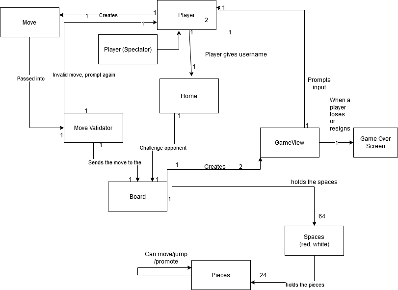

# PROJECT Design Documentation

## Team Information
* Team name: Team A
* Team members
  * Aubrey Tarmu
  * Ethan Yi
  * Tony Jiang

## Executive Summary
> Web-Checkers is a web based checkersGame game that can be played by two separate users through a server. The user interface of the checkersGame game supports browser drag and drop functionality. This application is a Java based web server and utilizes the Spark web micro framework and the FreeMarker template engine. Beyond implementing a a basic checkersGame game, we have implemented a spectate mode enhancement where other players can spectate ongoing games.

### Purpose
> The purpose is to make a game of checkers that can be easily played over the internet. The user group is people who have internet excess and an interest in checkersGame, and the goal is for them to be able to play a game of checkers.

### Glossary and Acronyms

| Term | Definition |
|------|------------|
| VO | Value Object |
| VM | View Model |
| CUT| Component under test  |

## Requirements

This section describes the features of the application.

### Definition of MVP
> The minimum viable product is a product that should be able to allow players to sign in and sign out. 
And once they are signed in, they should be able to challenge and play and American game of checkersGame with an opponent.
The game will end if any player is out of moves or pieces, or if a player resigns.

### MVP Features
> The highest level features of this product include Signing in, starting a game, updating board, and move validation through turns.
Sign in functionality helps the user create his/her unique identifier so that someone else can challenge them once they are online.
Starting a game overviews the process of challenging a user and creating a game for both players, unless they are already ingame.
Updating board covers how the gameboard updates after submitting each turn. Lastly, move validation covers the legality
of player moves

### Roadmap of Enhancements
> Enhancements include:
Creating a spectator mode, where others can spectate other ongoing games.

## Application Domain

This section describes the application domain.

> The domain model shows the relationship between the application domain and player behavior.
From sign in, the webcheckers mainly revolves around the relationship between the player, server, and the checkerboard.
As seen from the circular relationship from these 3 entities, player behavior with the gameboard can be easily visualized, until 
the game ends.

## Architecture and Design

This section describes the application architecture.

### Summary

The following Tiers/Layers model shows a high-level view of the webapp's architecture.

As a web application, the user interacts with the system using a
browser.  The client-side of the UI is composed of HTML pages with
some minimal CSS for styling the page.  There is also some JavaScript
that has been provided to the team by the architect.

The server-side tiers include the UI Tier that is composed of UI Controllers and Views.
Controllers are built using the Spark framework and View are built using the FreeMarker framework.  The Application and Model tiers are built using plain-old Java objects (POJOs).

Details of the components within these tiers are supplied below.

### Overview of User Interface

This section describes the web interface flow; this is how the user views and interacts
with the WebCheckers application.

> This statechart shows all possible states that the user web interface can be in. From no connection to signin, to playing games,
the HTTP verbs between states show how each view interacts with eachother. The flow of states clearly indicate predictive and deterministic
manners of players, accounting for potential errors when navigating the pages.

### UI Tier

The UI tier is majorly comprised of routes and their functionality dependent on the route handlers. 
The majority of the time spent in the application will be on the Gethomeroute which handles situations where the home page is triggered.
From homepage, getsigninroute will render a sign in page with a text prompt which is sent to postsigninroute to see if user successfully logged
in or needs to input a different user depending on error. If successful, the home page is rendered again, this time with a user identity.
From here, challenging an opponent will trigger getgameroute, with a queryparams stating who the opponent is. If the opponent is challenged, they
will be redirected to getgameroute as well. 
When players start to make moves, ajax calls are thrown so that the pertaining attributes of Board can be changed. PostValidateMove would handle move validity
at the moment when the piece is dragged, PostBackMove would allow players to backup before deciding to submit, PostResignGame gives players a chance to forfeit whenever,
and PostSubmitMove would permanently submit the move and switch turns. The waiting player utilizes PostCheckTurn constantly to check if its their turn yet.
Once the game ends, players would be directed to a gameover screen provided by getgameroute, which then exiting would prompt the gethomeroute.

GetSpectateRoute is utilized by a spectator to display a specialized gameview designed for spectators, where the only action would be to exit back to gethomeroute.
PostSpectateCheckTurn helps the spectate view by constantly refreshing.

### Application Tier
The application tier holds two classes which are integral for player to player interactions. PlayerLobby is a sidewide class that holds a lobby of all players. 
Since it is essential for challenging others and displaying the number of people online, PlayerLobby is instantiated in webserver, and is passed into all routes related
to starting games and signing in. Gamecenter holds all of the CheckersGame that were instantiated between players. Doing this allows players to share the same board so that
moves can be registered synchronously. Almost all routes use GameCenter to read and change Board data.

### Model Tier
There are numerous model tier classes, many of which are required for the sake of the checkers logic. Player is the only essential model tier classes needed for signin and game, as it holds a unique identifier and is essential for knowing if a playing is being challenged. The Board entity holds the literal gameboard, as a list of Rows, which is a list of Spaces. The Spaces hold pieces and their location in the board, and the type of piece (KING,SINGLE) determines their range of movement  .
BoardView is a separate class designed to create personalized views of the Board whether you are red or white player, and is instantiated once for each players
Move is created to parse user input on the board and is essential for checking for validity because it is passed into the Validator, which will tell the user if a move is legal or not.

Lastly, checkersGame holds the necesarry attributes for the GameView, and is the highest level entity that holds the Board. Thus, in acoordance to its hierarchy, it is stored in GameCenter.

### Design Improvement
The most important design improvement we need to make is to have lower coupling. There are too many dependencies between classes especially in the model tier.
Too many higher level classes are being passed in the constructor of lower level classes. If a more rigid hierarchy is established, there will be lower coupling,
and more classes with higher cohesion. 

## Testing

### Acceptance Testing
12 stories have been completed with acceptance testing. 

### Unit Testing and Code Coverage

For each class in each of the tiers, we created unit tests. Each of these tests have seams and mock dependencies so that the unit tests could be written 
without having to instantiate many new objects. 
Unfortunately because our classes didn't obey information expert well, our unit tests were hard to write since it was difficult to keep track of the information the classes depended on. Due to this, our coverage in the UI was poor, likely because that was the focus of sprint 2. Otherwise, model and application tier hit their targets
of at least 85%.
